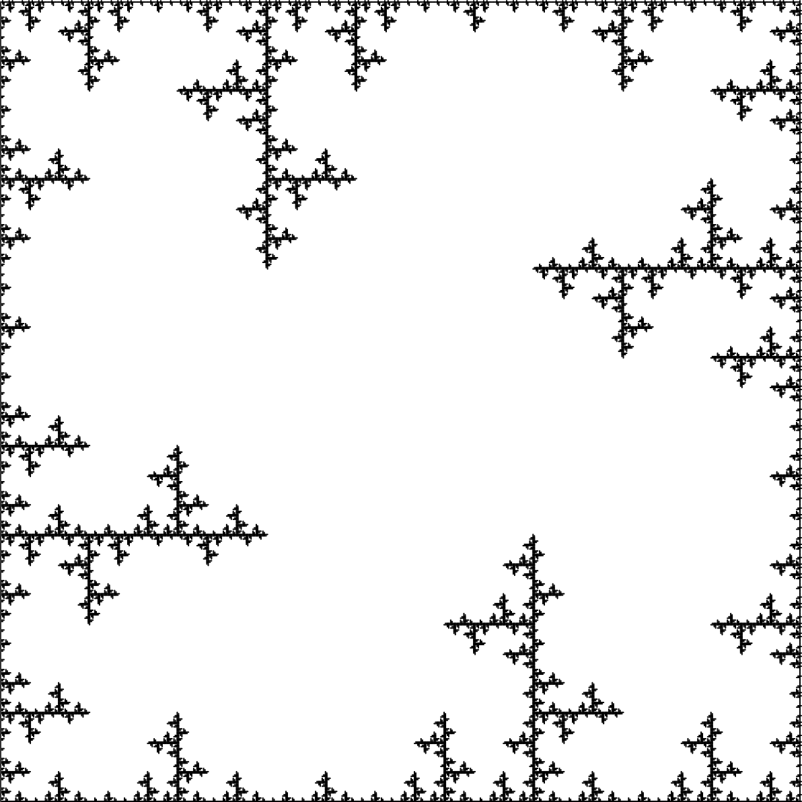
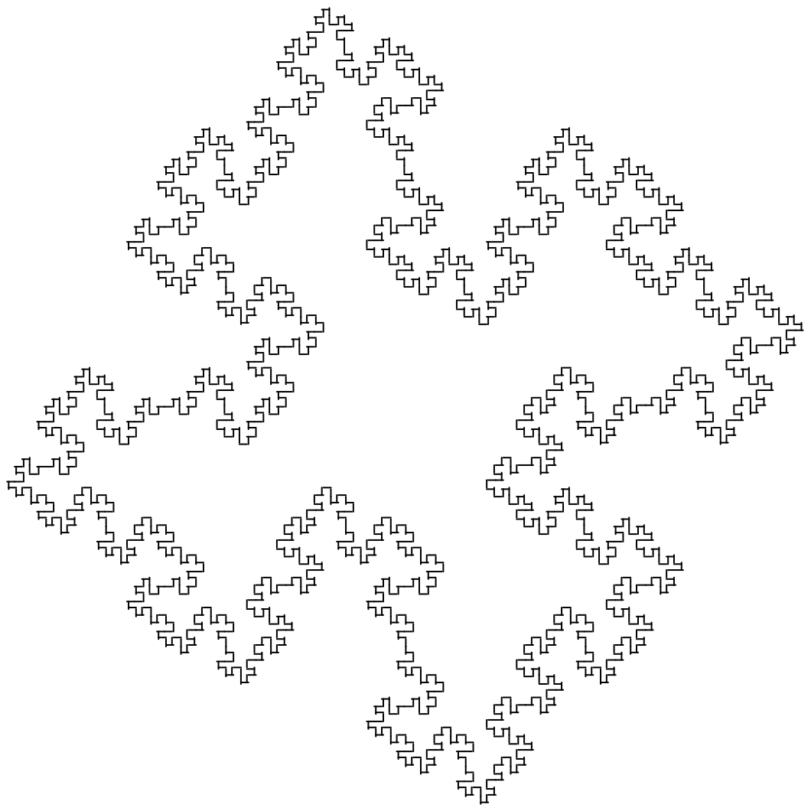

# L System Fractals

### Lindenmayer Systems visualization

**How they work:** An inital string is considered (called the axiom) with rewriting rules. During each iteration, the string is rewritten according to the rules.

For example, given an axiom **"F+F"** and a single rule **"F-->FF"**, after iteration 1, the string is now **"FF+FF"** because every "F" in the string became "FF". After iteration 2, the string becomes **"FFFF+FFFF"**.

This becomes interesting when each character in the string represents an instruction. This also forces all the results to be drawn by a single line. The instruction for each character is found below. 

---

### Plant-like systems

#### Bushes

#### Trees

#### Algae

---

### Fractals

#### Rings

#### Dragon Curve

#### Sierpinski Triangle

#### Sierpinski Arrowhead

#### Pentaplexity

#### Board

#### Cantor Set

---

### Space Fillers

#### Peano Curve

#### Quadratic Gosper

#### Square Sierpinski

---

### Others

#### Crystal

#### Levy Curve

#### Koch Curve

#### 0L-systems

Sources: 
https://en.wikipedia.org/wiki/L-system 
http://paulbourke.net/fractals/lsys/