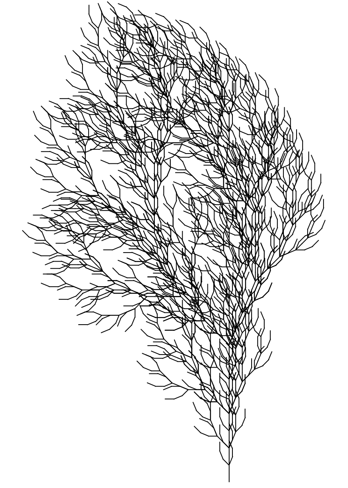
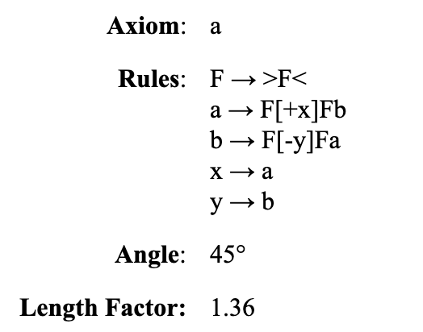
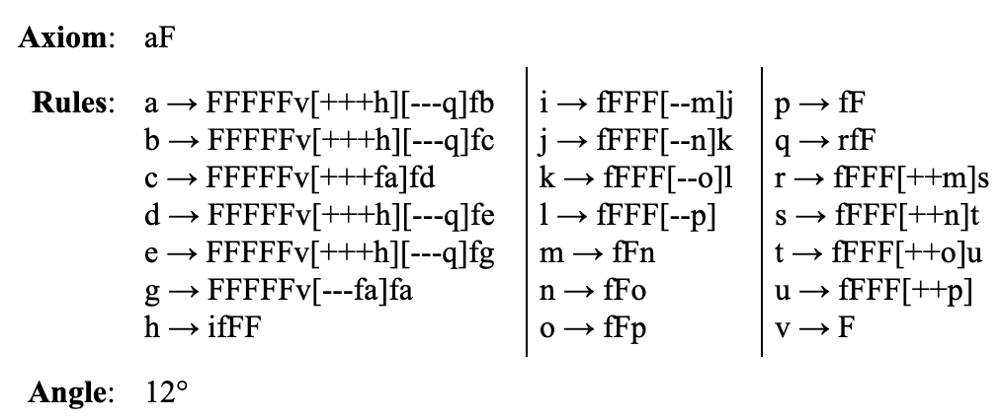

# L System Fractals

### Lindenmayer Systems visualization

### Table of Contents
- [Introduction](#introduction)
- [Plant-like Systems](#plant-like-systems)
- [Fractals](#fractals)
- [Space Fillers](#space-fillers)
- [Others](#others)
- [How to use](#how-to-use)

### Introduction

**How they work:** An inital string is considered (called the axiom) with rewriting rules. During each iteration, the string is rewritten according to the rules.

For example, given an axiom **"F+F"** and a single rule **"F-->FF"**, after iteration 1, the string is now **"FF+FF"** because every "F" in the string became "FF". After iteration 2, the string becomes **"FFFF+FFFF"**.

This becomes interesting when each character in the string represents an instruction. This also forces all the results to be drawn by a single line. The instruction for each character is found below. 

---

### Plant-like systems

#### Bushes

#### Trees

#### Algae

---

### Fractals

#### Rings

#### Dragon Curve

#### Sierpinski Triangle

#### Sierpinski Arrowhead

#### Pentaplexity

#### Board

#### Cantor Set

---

### Space Fillers

#### Peano Curve

#### Quadratic Gosper

#### Square Sierpinski

---

### Others

#### Crystal

#### Levy Curve

#### Koch Curve

#### 0L-systems

---

### How to use

A JSON file exists for each L-system which defines its axiom, all its rules, etc. A JSON file can be created for any L-system and be visualized with this project. A sample JSON file is below:

**Mandatory** 
startX and startY are numbers from 0 to 1 which refer to the starting location of the system. 
startAngle refers to which direction the curve starts at. 
Angle refers to how much rotation is applied for a **+** or **-** symbol. 

**Optional** 
lengthFactor is the factor to multiply or divide the length for a **<** or **>** symbol.

Sources: 
https://en.wikipedia.org/wiki/L-system 
http://paulbourke.net/fractals/lsys/